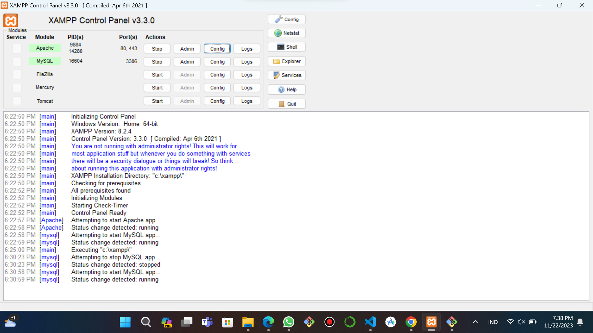
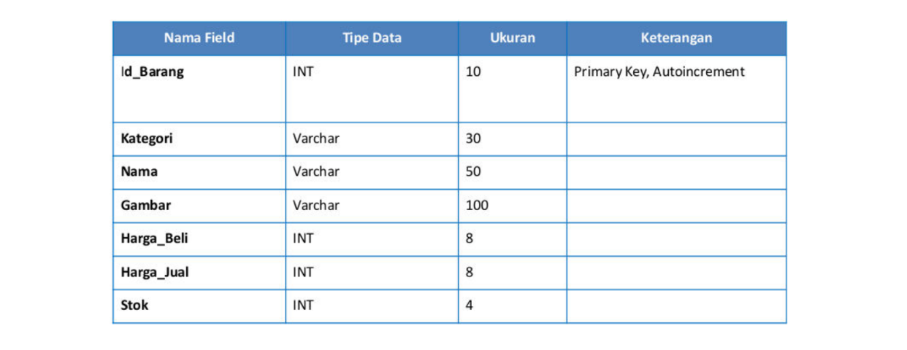
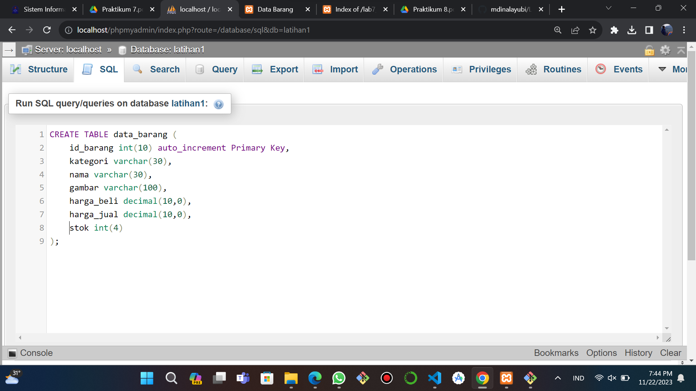
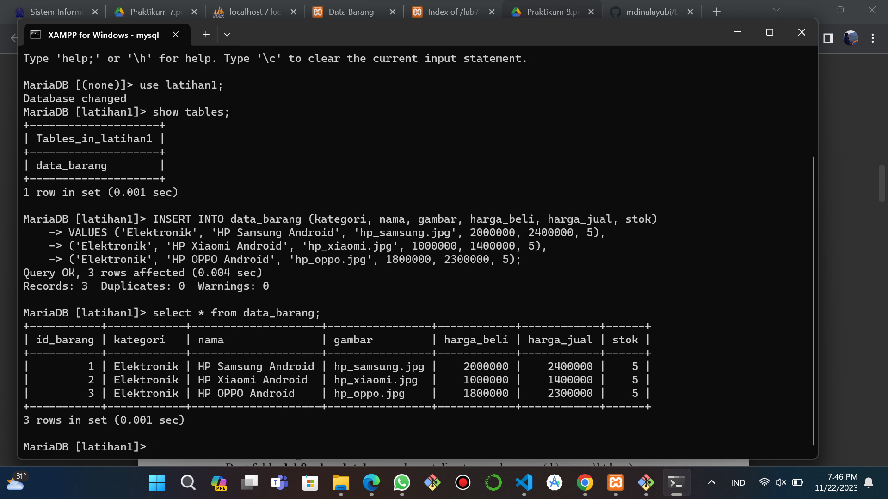
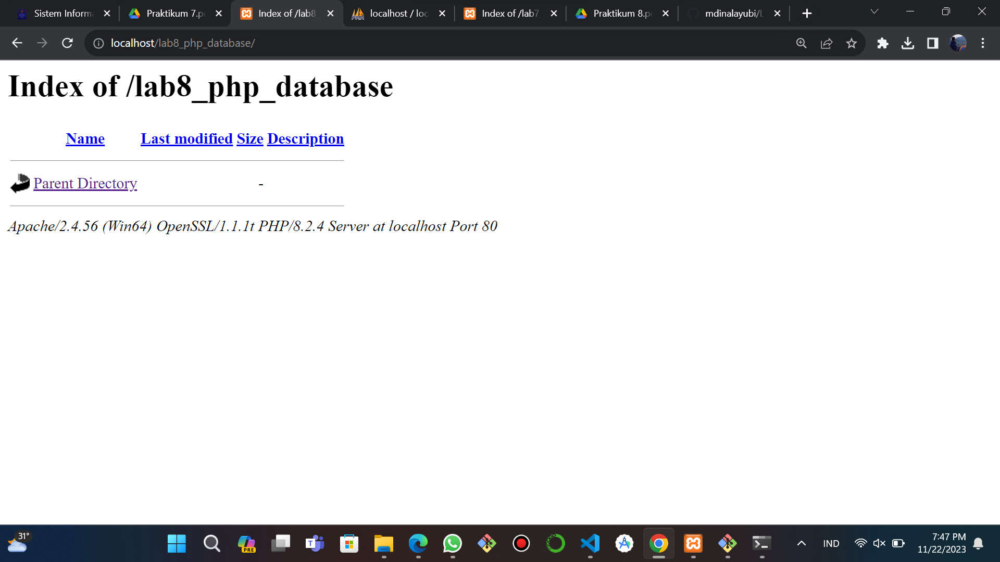
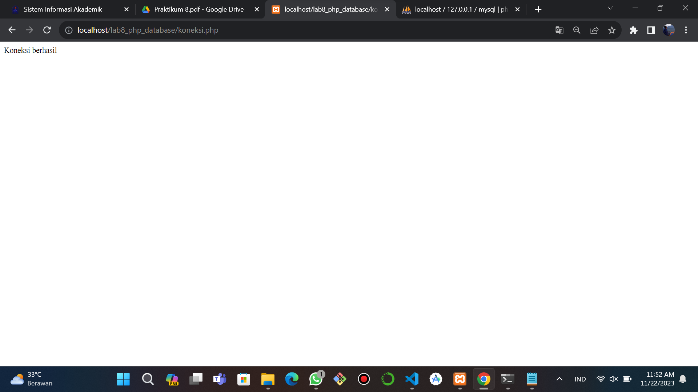
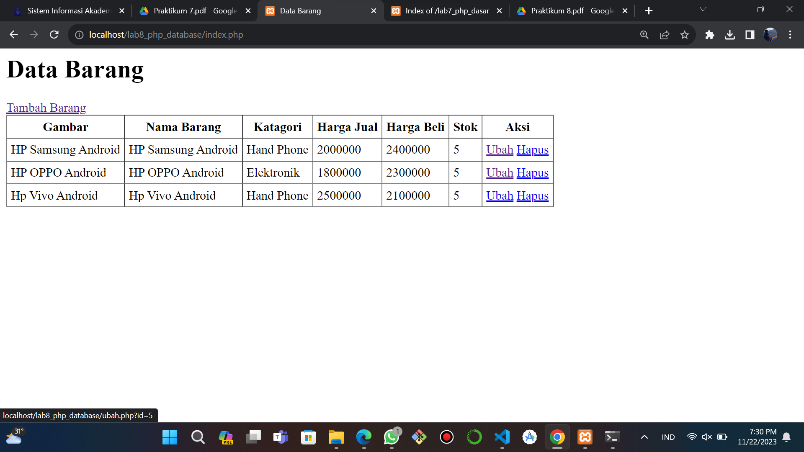
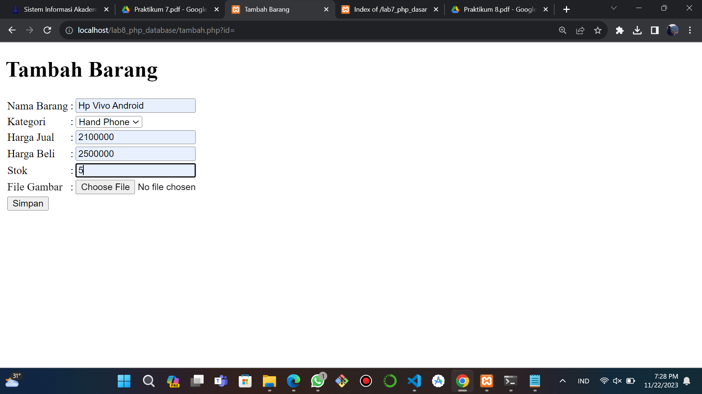
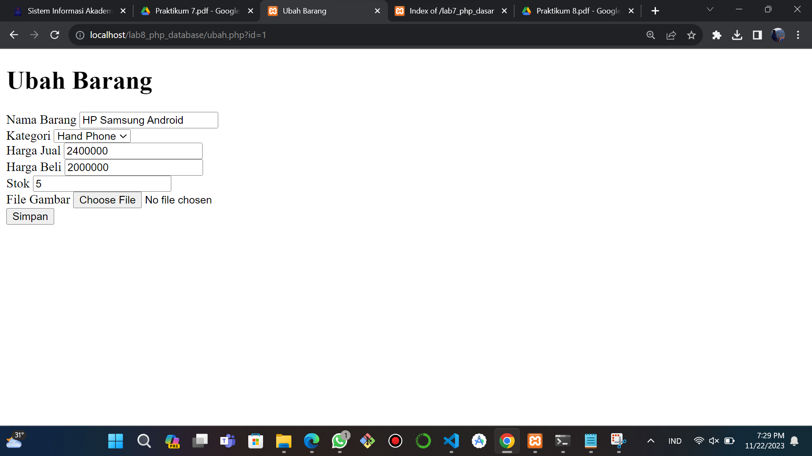

| Nama      | Muhammad Din Al Ayubi |
| ----------- | ----------- |
| NIM     | 312010293       |
| Kelas   | TI.22.A.3        |
|          Lab8web          |
## Instruksi Praktikum
1. Persiapkan text editor misalnya VSCode.
2. Buat folder baru dengan nama lab8_php_database pada docroot webserver (htdocs)
3. Ikuti langkah-langkah praktikum yang akan dijelaskan berikutnya.
### Langkah-langkah Praktikum
### Persiapan
#### Untuk memulai membuat aplikasi CRUD sederhana, yang perlu disiapkan adalah database server menggunakan MySQL. Pastikan MySQL Server sudah dapat dijalankan melalui XAMPP.
#### Menjalankan MySQL Server Untuk menjalankan MySQL Server dari menu XAMPP Contol.

### Menjalankan MySQL Server
#### Untuk menjalankan MySQL Server dari menu XAMPP Contol.

### Mengakses MySQL Client menggunakan PHP MyAdmin
#### Pastikan webserver Apache dan MySQL server sudah dijalankan. Kemudian buka melalui browser: http://localhost/phpmyadmin/
### Membuat Database: Studi Kasus Data Barang

### Membuat Database
```python
CREATE DATABASE latihan1;
```
### Membuat Tabel
```python
CREATE TABLE data_barang (
    id_barang int(10) auto_increment Primary Key,
    kategori varchar(30),
    nama varchar(30),
    gambar varchar(100),
    harga_beli decimal(10,0),
    harga_jual decimal(10,0),
    stok int(4)
);
```

### Menambahkan Data
```python
INSERT INTO data_barang (kategori, nama, gambar, harga_beli, harga_jual, stok)
VALUES ('Elektronik', 'HP Samsung Android', 'hp_samsung.jpg', 2000000, 2400000, 5),
('Elektronik', 'HP Xiaomi Android', 'hp_xiaomi.jpg', 1000000, 1400000, 5),
('Elektronik', 'HP OPPO Android', 'hp_oppo.jpg', 1800000, 2300000, 5);
```

### Membuat Program CRUD
#### Buat folder lab8_php_database pada root directory web server (c:\xampp\htdocs)

#### Kemudian untuk mengakses direktory tersebut pada web server dengan mengakses URL: http://localhost/lab8_php_database/

### Membuat file koneksi database
#### Buat file baru dengan nama ```koneksi.php```
```python
<?php
$host = "localhost";
$user = "root";
$pass = "";
$db = "latihan1";
$conn = mysqli_connect($host, $user, $pass, $db);
if ($conn == false)
{
  echo "Koneksi ke server gagal.";
  die();
} #else echo "Koneksi berhasil";
?>
```
#### Buka melalui browser untuk menguji koneksi database untuk menyampilkan pesan koneksi berhasil, uncomment pada perintah ```echo “koneksi berhasil”;```

### Membuat file index untuk menampilkan data (Read)
#### Buat file baru dengan nama ```index.php```
```python
<?php
include("koneksi.php");

$sql = 'SELECT * FROM data_barang';
$result = mysqli_query($conn, $sql);

?>
<DOCTYPE html>
<html lang="en">
<head>
    <meta charset="UTF-8">
    <link href="style.css" rel="stylesheet" type="text/css" />
    <title>Data Barang</title>
</head>
<body>
    <div class="container">
        <h1>Data Barang</h1>
        <tr>
            <a href="tambah.php?id=">Tambah Barang</a>
        </tr>

        <div class="main">
            <table border="1" cellpadding="5" cellspacing="0">
            <tr>
                <th>Gambar</th>
                <th>Nama Barang</th>
                <th>Katagori</th>
                <th>Harga Jual</th>
                <th>Harga Beli</th>
                <th>Stok</th>
                <th>Aksi</th>
            </tr>
            <?php if($result): ?>
            <?php while($row = mysqli_fetch_array($result)): ?>
            <tr>
                <td><?= $row['nama'];?></td>
                <td><?= $row['nama'];?></td>
                <td><?= $row['kategori'];?></td>
                <td><?= $row['harga_beli'];?></td>
                <td><?= $row['harga_jual'];?></td>
                <td><?= $row['stok'];?></td>
                <td>
                    <a href="ubah.php?id=<?= $row['id_barang'];?>">Ubah</a>
                    <a href="hapus.php?id=<?= $row['id_barang'];?>">Hapus</a>
                </td>
            </tr>
            <?php endwhile; else: ?>
            <tr>
                <td colspan="7">Belum ada data</td>
            </tr>
            <?php endif; ?>
            </table>
        </div>
    </div>
</body>
</html>
```

### Menambah Data (Create)
#### Buat file baru dengan nama ```tambah.php```
```python
<?php
include("koneksi.php");

$sql = 'SELECT * FROM data_barang';
$result = mysqli_query($conn, $sql);

?>
<DOCTYPE html>
<html lang="en">
<head>
    <meta charset="UTF-8">
    <link href="style.css" rel="stylesheet" type="text/css" />
    <title>Data Barang</title>
</head>
<body>
    <div class="container">
        <h1>Data Barang</h1>
        <tr>
            <a href="tambah.php?id=">Tambah Barang</a>
        </tr>

        <div class="main">
            <table border="1" cellpadding="5" cellspacing="0">
            <tr>
                <th>Gambar</th>
                <th>Nama Barang</th>
                <th>Katagori</th>
                <th>Harga Jual</th>
                <th>Harga Beli</th>
                <th>Stok</th>
                <th>Aksi</th>
            </tr>
            <?php if($result): ?>
            <?php while($row = mysqli_fetch_array($result)): ?>
            <tr>
                <td><?= $row['nama'];?></td>
                <td><?= $row['nama'];?></td>
                <td><?= $row['kategori'];?></td>
                <td><?= $row['harga_beli'];?></td>
                <td><?= $row['harga_jual'];?></td>
                <td><?= $row['stok'];?></td>
                <td>
                    <a href="ubah.php?id=<?= $row['id_barang'];?>">Ubah</a>
                    <a href="hapus.php?id=<?= $row['id_barang'];?>">Hapus</a>
                </td>
            </tr>
            <?php endwhile; else: ?>
            <tr>
                <td colspan="7">Belum ada data</td>
            </tr>
            <?php endif; ?>
            </table>
        </div>
    </div>
</body>
</html>
```

### Mengubah Data (Update)
#### Buat file baru dengan nama ```ubah.php```
```python
<?php
error_reporting(E_ALL);
include_once 'koneksi.php';
if (isset($_POST['submit']))
{
	$id = $_POST['id'];
	$nama = $_POST['nama'];
	$kategori = $_POST['kategori'];
	$harga_jual = $_POST['harga_jual'];
	$harga_beli = $_POST['harga_beli'];
	$stok = $_POST['stok'];
	$file_gambar = $_FILES['file_gambar'];
	$gambar = null;
 
	if ($file_gambar['error'] == 0)
	{
		$filename = str_replace(' ', '_', $file_gambar['name']);
		$destination = dirname(__FILE__) . '/gambar/' . $filename;
		if (move_uploaded_file($file_gambar['tmp_name'], $destination))
		{
			$gambar = 'gambar/' . $filename;;
		}
	}
	$sql = 'UPDATE data_barang SET ';
	$sql .= "nama = '{$nama}', kategori = '{$kategori}', ";
	$sql .= "harga_jual = '{$harga_jual}', harga_beli = '{$harga_beli}', stok 
= '{$stok}' ";
	if (!empty($gambar))
		$sql .= ", gambar = '{$gambar}' ";
	$sql .= "WHERE id_barang = '{$id}'";
	$result = mysqli_query($conn, $sql);
	
	header('location: index.php');
}

$id = $_GET['id'];
$sql = "SELECT * FROM data_barang WHERE id_barang = '{$id}'";
$result = mysqli_query($conn, $sql);
if (!$result) die('Error: Data tidak tersedia');
$data = mysqli_fetch_array($result);

function is_select($var, $val) {
 if ($var == $val) return 'selected="selected"';
 return false;
}

?>
<!DOCTYPE html>
<html lang="en">
<head>
	<meta charset="UTF-8">
	<link href="style.css" rel="stylesheet" type="text/css" />
	<title>Ubah Barang</title>
</head>
<body>
<div class="container">
	<h1>Ubah Barang</h1>
	<div class="main">
		<form method="post" action="ubah.php"
enctype="multipart/form-data">
			<div class="input">
				<label>Nama Barang</label>
				<input type="text" name="nama" value="<?php echo 
$data['nama'];?>" />
			</div>
			<div class="input">
	 			<label>Kategori</label>
				<select name="kategori">
	 				<option <?php echo is_select
('Komputer', $data['kategori']);?> value="Komputer">Komputer</option>
	 				<option <?php echo is_select
('Komputer', $data['kategori']);?> value="Elektronik">Elektronik</option>
 					<option <?php echo is_select
('Komputer', $data['kategori']);?> value="Hand Phone">Hand Phone</option>
				</select>
			</div>
			<div class="input">
				<label>Harga Jual</label>
				<input type="text" name="harga_jual" value="<?php echo 
$data['harga_jual'];?>" />
			</div>
			<div class="input">
				<label>Harga Beli</label>
				<input type="text" name="harga_beli" value="<?php echo 
$data['harga_beli'];?>" />
			</div>
			<div class="input">
				<label>Stok</label>
				<input type="text" name="stok" value="<?php echo 
$data['stok'];?>" />
			</div>
			<div class="input">
				<label>File Gambar</label>
				<input type="file" name="file_gambar" />
			</div>
			<div class="submit">
				<input type="hidden" name="id" value="<?php echo 
$data['id_barang'];?>" />
				<input type="submit" name="submit" value="Simpan" />
			</div>
		</form>
	</div>
</div>
</body>
</html>
```

### Menghapus Data (Delete)
#### Buat file baru dengan nama ```hapus.php```
```python
<?php
include_once 'koneksi.php';
$id = $_GET['id'];
$sql = "DELETE FROM data_barang WHERE id_barang = '{$id}'";
$result = mysqli_query($conn, $sql);
header('location: index.php');
?>
```
## Laporan Praktikum
1. Buatlah repository baru dengan nama Lab8Web.
2. Kerjakan semua latihan yang diberikan sesuai urutannya.
3. Screenshot setiap perubahannya.
4. Buatlah file README.md dan tuliskan penjelasan dari setiap langkah praktikum beserta screenshotnya.
5. Commit hasilnya pada repository masing-masing.
6. Kirim URL repository pada e-learning ecampus
